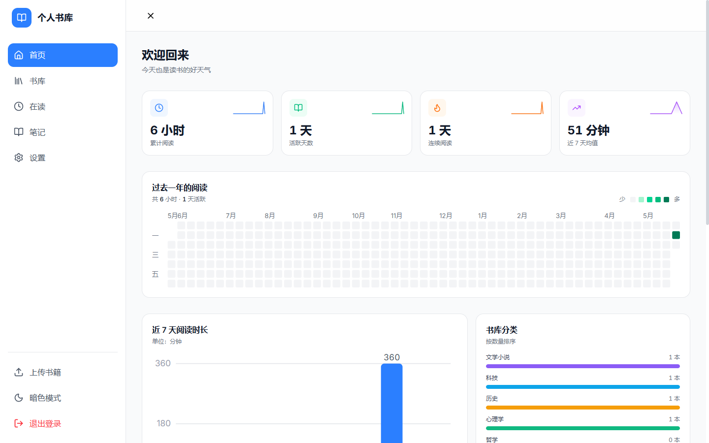
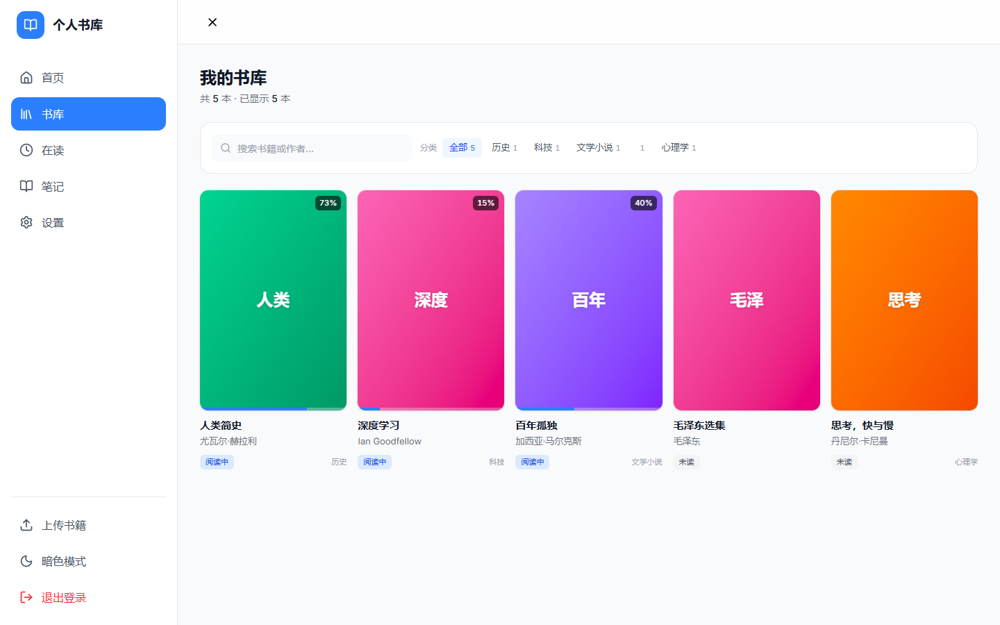
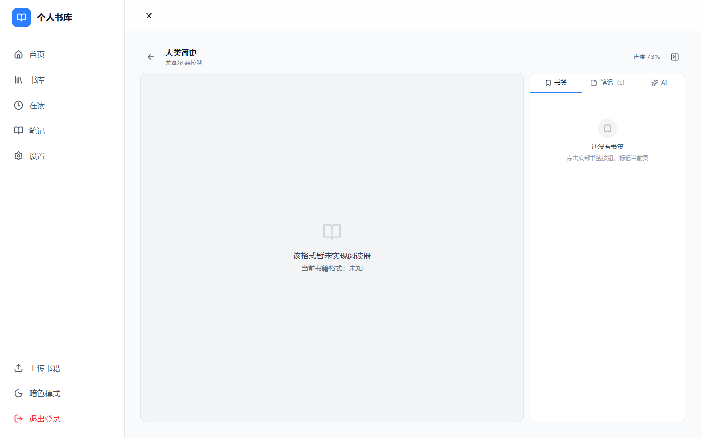
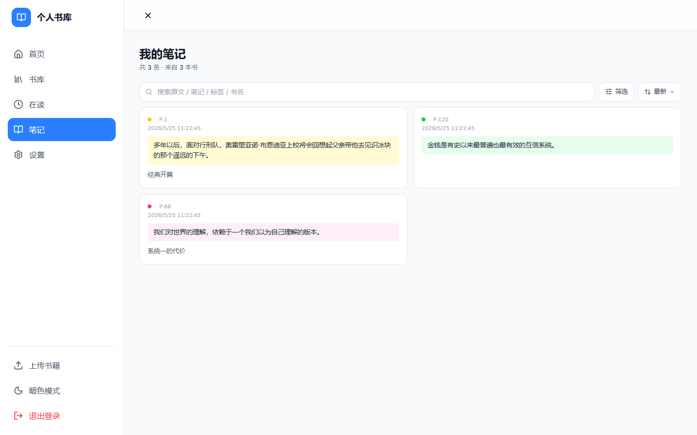
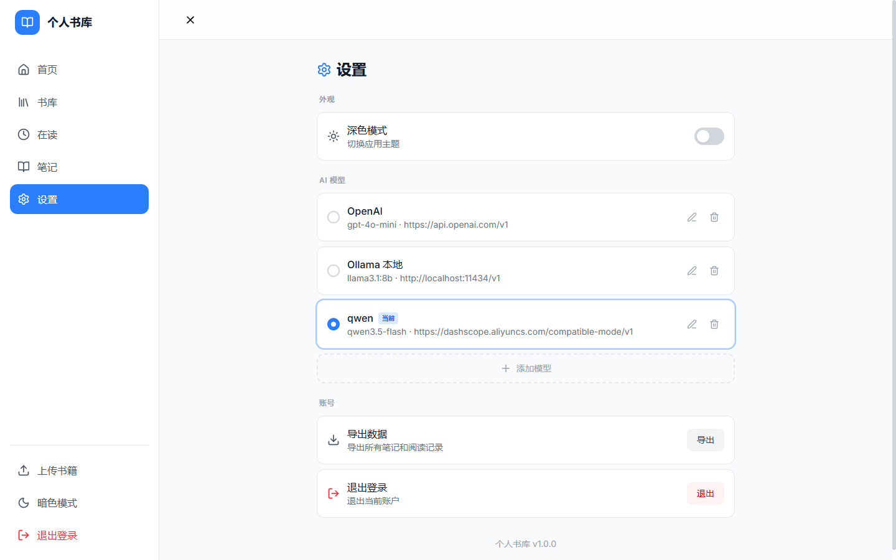

<p align="center">
  
</p>

<h1 align="center">BookHub</h1>

<p align="center">
  <b>个人电子书阅读管理</b>
</p>

<p align="center">
  
  
  
  
  
  
  
</p>

<p align="center">
  <b>BookHub</b> 是一款面向本地部署的个人电子书阅读管理应用，支持 PDF / EPUB / TXT 格式，提供阅读进度追踪、书签高亮、AI 阅读助手等完整功能。
</p>

---

## 功能特性

| 模块 | 功能 |
|------|------|
| **书库管理** | 支持 EPUB / PDF / MOBI / TXT 格式上传，自动提取元数据，分类标签管理 |
| **阅读器** | 内置 PDF 阅读器，支持缩放、翻页、进度记忆 |
| **书签与高亮** | 添加书签、文本高亮、批注笔记，支持多颜色标记 |
| **AI 阅读助手** | 对接 OpenAI / Claude / 自定义 API，基于书籍内容上下文对话 |
| **阅读统计** | 年度/月度阅读热力图、阅读时长统计、连续阅读天数 |
| **数据持久化** | SQLite 本地存储，数据完全自主可控 |

---

## 界面预览

| 首页仪表盘 | 书库管理 |
|:---:|:---:|
|  |  |

| 书籍上传 | 阅读器 |
|:---:|:---:|
|  |  |

| 笔记高亮 | 设置中心 |
|:---:|:---:|
|  |  |

---

## 技术架构

```
book-hub/
├── frontend/          # React 19 + Vite + Tailwind CSS + Zustand
│   ├── src/
│   │   ├── pages/     # 页面组件 (Dashboard / Library / Reader / Notes / Settings / Upload)
│   │   ├── store/     # Zustand 状态管理 (booksStore / notesStore / settingsStore / aiChatStore)
│   │   ├── components/# 复用组件 (CoverCropper / EditBookModal)
│   │   └── data/      # 类型定义与 mock 数据
│   └── dist/          # 构建输出 (生产环境由后端 serve)
├── backend/           # Express + TypeScript + SQLite
│   ├── src/
│   │   ├── routes/    # API 路由
│   │   ├── services/  # 业务逻辑 (AI 代理、统计计算)
│   │   ├── repositories/ # 数据访问层
│   │   ├── db/        # 数据库连接与初始化
│   │   └── middleware/# 错误处理等中间件
│   ├── data/          # SQLite 数据库文件
│   └── uploads/       # 书籍文件与封面存储
└── docs/              # 设计文档
```

### 技术栈

| 层级 | 技术 | 说明 |
|------|------|------|
| 前端框架 | React 19 + TypeScript | 函数组件 + Hooks |
| 构建工具 | Vite 6 | 极速 HMR，开发代理转发 API |
| 样式方案 | Tailwind CSS 4 | 原子化 CSS，支持深色模式 |
| 状态管理 | Zustand 5 | 轻量级，多 store 拆分 |
| 后端框架 | Express 5 | RESTful API |
| 运行时 | Bun | 统一包管理器，前后端共用 |
| 数据库 | SQLite (better-sqlite3) | 单文件，零配置 |
| 文件上传 | Multer | 本地存储 |

---

## 快速开始

### 环境要求

- [Bun](https://bun.sh/) >= 1.0
- Node.js >= 18 (前端构建需要)

### 本地开发

```bash
# 1. 克隆仓库
git clone https://github.com/Yikuanzz/book-hub.git
cd book-hub

# 2. 安装所有依赖 (monorepo)
bun install

# 3. 同时启动前后端
cd frontend && npm run dev   # 终端 1 - 前端 http://localhost:5173
cd backend && bun run dev    # 终端 2 - 后端 http://localhost:3001
```

前端开发服务器已通过 Vite proxy 将 `/api` 和 `/uploads` 转发到后端。

### 生产构建

```bash
# 构建前端
cd frontend && npm run build

# 编译后端
cd backend && bun run build

# 启动生产服务
NODE_ENV=production cd backend && bun run dist/index.js
# 服务运行于 http://localhost:3001，同时 serve 前端构建产物
```

---

## Docker 部署

### 使用预构建镜像

```bash
# 拉取镜像 (替换为你的 GitHub 用户名/仓库名)
docker pull ghcr.io/yikuanzz/book-hub:latest

# 运行容器
docker run -d \
  --name bookhub \
  -p 3001:3001 \
  -v bookhub-data:/app/backend/data \
  -v bookhub-uploads:/app/backend/uploads \
  ghcr.io/yikuanzz/book-hub:latest
```

### 使用 Docker Compose

```yaml
# docker-compose.yml
version: "3.8"

services:
  bookhub:
    image: ghcr.io/yikuanzz/book-hub:latest
    container_name: bookhub
    ports:
      - "3001:3001"
    volumes:
      - ./data:/app/backend/data
      - ./uploads:/app/backend/uploads
    environment:
      - NODE_ENV=production
      - PORT=3001
    restart: unless-stopped
```

启动：
```bash
docker compose up -d
```

### 自行构建镜像

```bash
docker build -t book-hub .
docker run -d -p 3001:3001 --name bookhub book-hub
```

---

## API 文档

所有 API 返回统一格式：

```json
{ "success": true, "data": {} }
{ "success": false, "error": "...", "details": [] }
```

### 核心接口

| 方法 | 路径 | 说明 |
|------|------|------|
| `GET` | `/api/books` | 书籍列表 |
| `POST` | `/api/books` | 创建书籍 |
| `GET` | `/api/books/:id` | 书籍详情 |
| `PUT` | `/api/books/:id/progress` | 更新阅读进度 |
| `GET` | `/api/highlights` | 高亮/笔记列表 |
| `POST` | `/api/highlights` | 创建高亮 |
| `GET` | `/api/settings/ai-providers` | AI 提供商配置 |
| `GET` | `/api/stats/dashboard` | 仪表盘统计 |
| `GET` | `/api/health` | 健康检查 |

完整 API 设计详见 [后端设计文档](./docs/superpowers/specs/2026-05-23-bookhub-backend-design.md)。

---

## 项目结构

```
book-hub/
├── frontend/                 # 前端应用
│   ├── src/
│   │   ├── pages/           # 页面：首页/书库/阅读器/笔记/设置/上传
│   │   ├── store/           # Zustand stores
│   │   ├── components/      # 共享组件
│   │   └── data/            # 类型定义
│   ├── package.json         # npm scripts + dependencies
│   └── vite.config.ts       # Vite 配置 + dev proxy
│
├── backend/                  # 后端服务
│   ├── src/
│   │   ├── index.ts         # Express 入口
│   │   ├── routes/          # API 路由
│   │   ├── services/        # 业务逻辑层
│   │   ├── repositories/    # 数据访问层 (SQLite)
│   │   ├── db/              # 数据库初始化
│   │   └── middleware/      # 错误处理中间件
│   ├── data/                # SQLite 数据库 (volume 挂载)
│   ├── uploads/             # 上传文件存储 (volume 挂载)
│   └── package.json         # bun scripts + dependencies
│
├── Dockerfile               # 多阶段构建
├── docker-compose.yml       # Docker Compose 配置
├── .github/workflows/       # CI/CD: Docker 镜像构建与发布
└── README.md                # 本文档
```

---

## 开发计划

- [x] 前端 UI 设计与实现
- [x] 后端 API 设计与实现
- [x] SQLite 数据库与数据持久化
- [x] 文件上传与静态资源服务
- [x] AI 对话集成
- [x] 阅读统计与热力图
- [x] Docker 镜像构建
- [x] GitHub Actions CI/CD
- [ ] 多用户支持
- [ ] EPUB 格式阅读器
- [ ] 阅读数据导入/导出

---

## 贡献指南

1. Fork 本仓库
2. 创建功能分支：`git checkout -b feature/xxx`
3. 提交更改：`git commit -m "feat: xxx"`
4. 推送分支：`git push origin feature/xxx`
5. 创建 Pull Request

---

## License

MIT License

---

<p align="center">
  Built with React + Express + Bun
</p>
